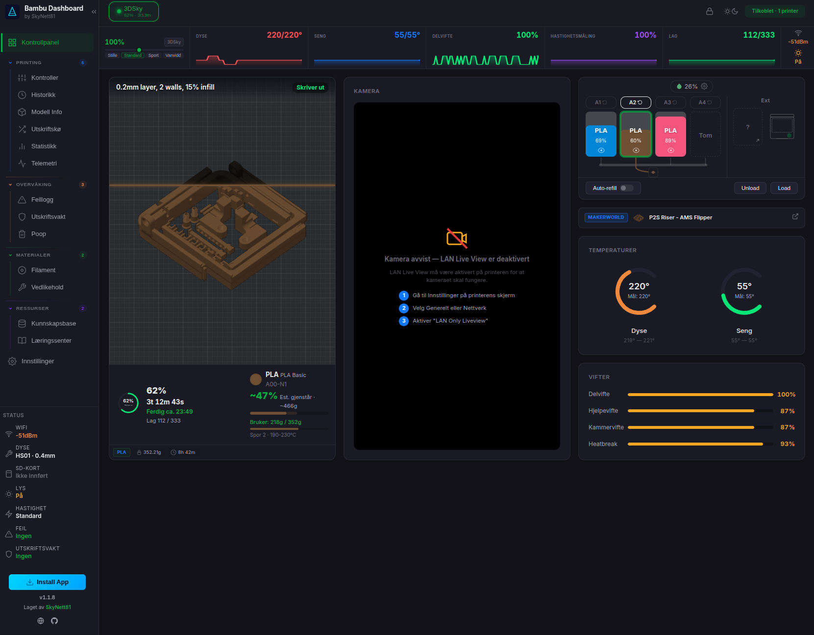

# Bambu Dashboard

> Self-hosted web dashboard for monitoring and controlling Bambu Lab 3D printers over your local network.

Created by **SkyNett81** &bull; [AGPL-3.0 License](LICENSE)



---

## Features

### Real-time Monitoring
- **Live sparkline stats** — Grafana-style rolling graphs for nozzle, bed, chamber temps, fan speed, print speed, and layer progress
- **Temperature gauges** — animated SVG ring gauges for nozzle, bed, and chamber
- **Print progress** — percentage ring, countdown timer, ETA, elapsed time, layer info
- **3D print preview** — live 3D model viewer with layer-by-layer animation and filament color tracking
- **3D fullscreen** — click to open full-size 3D view with real-time layer progress
- **MakerWorld integration** — auto-detects MakerWorld prints and shows model image with visual print progress reveal
- **AMS visualization** — filament colors, remaining %, humidity, temperature (multi-AMS support)
- **Camera livestream** — RTSPS via ffmpeg + jsmpeg, click-to-fullscreen with direct stream URL

### Multi-printer Support
- Manage multiple printers from a single dashboard
- Instant printer switching with per-printer data across all panels
- Supports P1, P2, X1, A1, and H2D series

### Controls
- Pause / resume / stop with confirmation dialogs
- Light toggle, speed profiles (Silent / Standard / Sport / Ludicrous)
- Fan control (part, aux, chamber), temperature presets
- Home / calibration commands, G-code console

### Print Guard
- **Automatic print protection** using printer xcam sensors
- Spaghetti detection, first layer issues, foreign objects, nozzle clumps
- Configurable actions per event: notify, pause, stop, or ignore
- Per-printer settings with cooldown and auto-resume options
- Active alert dashboard with resolve functionality
- Full protection event log

### Data & Analytics
- **Print history** — full log with status, duration, filament, layers (CSV export)
- **Statistics** — success rates, filament usage by type/brand, prints per week, monthly trends
- **Telemetry** — hero cards for live values, fan dashboard, time-series charts for temperatures/fans/speed
- **Error log** — all printer errors with severity, timestamps, and search
- **Filament inventory** — hero card summary, AMS tray display with progress bars, spool management with drag-and-drop between printers, stock health visualization
- **Waste tracking** — automatic and manual waste logging with cost estimates
- **Maintenance** — component wear tracking, nozzle history, maintenance scheduling

### Notifications
6 channels supported: **Telegram**, **Discord**, **Email (SMTP)**, **Webhook**, **ntfy**, **Pushover**

Events: print started, finished, failed, cancelled, printer error, maintenance due, bed cooled, update available, protection alert. Quiet hours supported.

### Infrastructure
- **Authentication** — optional password protection with session management
- **17 languages** — English, Norwegian, German, French, Spanish, Italian, Japanese, Korean, Dutch, Polish, Portuguese (BR), Swedish, Turkish, Ukrainian, Chinese (Simplified), Czech, Hungarian
- **HTTPS support** — auto-detected from `certs/` directory
- **Browser notifications** — real-time alerts for print events
- **Responsive design** — desktop, tablet, mobile
- **Modern UI** — glassmorphism effects, smooth transitions, Inter font
- **Auto-update** — checks GitHub Releases, one-click update with automatic backup
- **Demo mode** — 3 mock printers for testing without hardware
- **Setup wizard** — web-based first-time configuration
- **Zero framework frontend** — pure HTML/CSS/JS, no build step
- **Layout lock** — drag-and-drop module ordering in all panels, lock/unlock layout
- **Pterodactyl / wisp.gg** — ready-made egg file for game panel hosting

---

## Changelog

### v1.1.1 — Visual Redesign + Print Guard (2026-02-28)

**Visual Redesign**
- Complete UI overhaul — softer border-radius (14px), glassmorphism effects, subtle shadows, smooth cubic-bezier transitions
- Inter font across the entire dashboard
- Redesigned all 8 panels: Controls, History, Statistics, Telemetry, Filament, Error Log, Waste, and Maintenance
- Hero card grids with live stats on Telemetry and Filament panels
- Card title headers with SVG icons across all modules
- Improved responsive breakpoints for mobile/tablet

**Print Guard**
- New automatic print protection system using printer xcam sensors
- Detects spaghetti, first layer issues, foreign objects, and nozzle clumps
- Configurable actions per event type: notify, pause, stop, or ignore
- Per-printer settings with cooldown and auto-resume options
- Active alert dashboard with resolve functionality
- Full protection event log with filtering

**Camera & 3D Fullscreen**
- Click camera stream to open fullscreen modal
- Stream URL display with copy-to-clipboard in fullscreen
- Click 3D preview / MakerWorld image to open fullscreen
- Real-time layer progress in fullscreen (both 3D model and MakerWorld reveal)
- MakerWorld fullscreen mirrors the progress card view exactly

**Authentication**
- Optional password protection with session management
- Username + password or simple password mode
- Environment variable support for Docker/Pterodactyl deployments

**Other**
- 6 new notification channels: Telegram, Discord, Email, Webhook, ntfy, Pushover
- Protection alert notification type added to all channels
- Database migrations v9-v11 (protection settings, protection log)
- Settings dialog improvements: notification test, auth config
- Pterodactyl/wisp.gg egg file included

### v1.1.0 — 3D Preview, MakerWorld, Notifications (2025)

- 3D print preview with live layer animation
- MakerWorld integration with model image progress reveal
- Multi-channel notification system
- Auto-update from GitHub Releases
- Dashboard layout with drag-and-drop module ordering
- AMS visualization with multi-AMS support

### v1.0.0 — Initial Release (2025)

- Real-time printer monitoring via MQTT
- Temperature gauges and sparkline stats
- Camera livestream via ffmpeg + jsmpeg
- Print history and statistics
- Multi-printer support
- 17 language translations

---

## Requirements

| Requirement | Version | Required | Notes |
|-------------|---------|----------|-------|
| **Node.js** | 22.0+ | Yes | Uses built-in SQLite via `--experimental-sqlite` |
| **npm** | Included with Node.js | Yes | Package manager |
| **ffmpeg** | Any recent version | No | Only needed for camera livestream |
| **git** | Any recent version | No | For cloning, auto-updates, and version control |

### Supported Printers

All Bambu Lab printers with LAN mode enabled:
- **P1 Series** — P1S, P1P
- **P2 Series** — P2S Combo
- **X1 Series** — X1 Carbon, X1E
- **A1 Series** — A1, A1 Mini
- **H2D Series** — H2D

### Network Requirements

| Port | Protocol | Direction | Purpose |
|------|----------|-----------|---------|
| 3000 | HTTP + WS | Inbound | Dashboard access |
| 3443 | HTTPS + WSS | Inbound | Secure dashboard (optional) |
| 9001+ | WS | Inbound | Camera streams (one per printer) |
| 8883 | MQTTS | Outbound | MQTT connection to printer |
| 322 | RTSPS | Outbound | Camera feed from printer |

The server and printers must be on the **same local network** (LAN). Each printer requires its **LAN access code** to be enabled.

### Supported Platforms

| Platform | Support |
|----------|---------|
| Linux (Ubuntu, Debian, Fedora, etc.) | Full support |
| macOS | Full support |
| Windows | Works with Node.js, no install script |
| Docker | Full support (`network_mode: host` required) |
| Pterodactyl / wisp.gg | Egg file included |

---

## Quick Start

For a detailed step-by-step guide, see **[INSTALL.md](INSTALL.md)**.

### Option 1: Install Script (Recommended)

```bash
git clone https://github.com/skynett81/bambu-dashboard.git
cd bambu-dashboard
./install.sh
```

This will:
1. Check/install Node.js 22+
2. Install npm dependencies
3. Launch a web-based setup wizard where you add your printers

The setup wizard runs at `http://<your-ip>:3000` — open it in your browser to complete setup.

For a terminal-based install instead:
```bash
./install.sh --cli
```

### Option 2: Manual Install

```bash
git clone https://github.com/skynett81/bambu-dashboard.git
cd bambu-dashboard
npm install
cp config.example.json config.json
```

Edit `config.json` with your printer details (see [Configuration](#configuration)), then:

```bash
npm start
```

Open `http://localhost:3000` in your browser.

### Option 3: Docker

```bash
git clone https://github.com/skynett81/bambu-dashboard.git
cd bambu-dashboard
cp config.example.json config.json
# Edit config.json with your printer details
docker compose up -d
```

> **Important:** `network_mode: host` is required for LAN access to printers via MQTT (port 8883) and camera streams (port 322). This is already set in `docker-compose.yml`.

### Option 4: Demo Mode (No Hardware)

Try the dashboard without a real printer:

```bash
git clone https://github.com/skynett81/bambu-dashboard.git
cd bambu-dashboard
npm install
npm run demo
```

This starts 3 simulated printers (P2S Combo, X1 Carbon, H2D) with live print cycles, telemetry, AMS data, and seeded history.

---

## Configuration

Edit `config.json` (created from `config.example.json`):

```json
{
  "printers": [
    {
      "id": "my-printer",
      "name": "My P1S",
      "ip": "192.168.1.100",
      "serial": "01S00A000000000",
      "accessCode": "12345678",
      "model": "P1S"
    }
  ],
  "server": {
    "port": 3000,
    "httpsPort": 3443,
    "cameraWsPortStart": 9001,
    "forceHttps": false
  },
  "camera": {
    "enabled": true,
    "resolution": "640x480",
    "framerate": 15,
    "bitrate": "1000k"
  }
}
```

### Finding Your Printer Details

| Field | Where to Find |
|-------|--------------|
| `ip` | Printer screen: Settings > WiFi/Network > IP Address |
| `serial` | Printer screen: Settings > Device > Serial Number |
| `accessCode` | Printer screen: Settings > WiFi/Network > LAN Access Code |
| `model` | Your printer model (e.g., `P1S`, `P2S Combo`, `X1 Carbon`, `A1 Mini`, `H2D`) |

> **Tip:** Printers can also be added, edited, and deleted from the Settings tab in the dashboard — no restart required.

### Multiple Printers

Add more entries to the `printers` array. Each printer gets its own MQTT connection and camera stream (on consecutive ports starting from `cameraWsPortStart`).

```json
{
  "printers": [
    { "id": "printer-1", "name": "P1S", "ip": "192.168.1.100", "serial": "...", "accessCode": "...", "model": "P1S" },
    { "id": "printer-2", "name": "X1C", "ip": "192.168.1.101", "serial": "...", "accessCode": "...", "model": "X1 Carbon" }
  ]
}
```

---

## HTTPS Setup

Place certificate files in the `certs/` directory:

```
certs/
  cert.pem
  key.pem
```

The server auto-detects certificates and enables HTTPS on port 3443. Set `"forceHttps": true` in config to redirect all HTTP traffic.

Generate a self-signed certificate for testing:
```bash
mkdir -p certs
openssl req -x509 -newkey rsa:2048 -keyout certs/key.pem -out certs/cert.pem -days 365 -nodes -subj '/CN=localhost'
```

---

## Authentication

Authentication is **disabled by default**. Enable it to protect the dashboard when exposed publicly.

### Simple Password (Default)

Add to `config.json`:
```json
{
  "auth": {
    "enabled": true,
    "password": "your-password"
  }
}
```

### Username + Password

```json
{
  "auth": {
    "enabled": true,
    "password": "your-password",
    "username": "admin",
    "sessionDurationHours": 24
  }
}
```

### Environment Variables

For Docker or Pterodactyl deployments, use environment variables instead of config:

```bash
BAMBU_AUTH_PASSWORD=your-password npm start
# Or with username:
BAMBU_AUTH_PASSWORD=your-password BAMBU_AUTH_USERNAME=admin npm start
```

When `BAMBU_AUTH_PASSWORD` is set, authentication is automatically enabled regardless of `config.json`.

Sessions last 24 hours by default (configurable via `sessionDurationHours`).

---

## Pterodactyl / wisp.gg

A ready-made egg file is included for Pterodactyl Panel, Pelican, and wisp.gg:

1. In your panel, go to **Nests** > **Import Egg**
2. Upload `egg-bambu-dashboard.json` from the project root
3. Create a server using the egg
4. Configure the **Server Port**, **Auth Password**, and other variables

The egg installs Node.js 22, ffmpeg, and clones the repository automatically. Reinstalling the server from the panel runs `git pull` to update to the latest release.

---

## Commands

| Command | Description |
|---------|-------------|
| `npm start` | Start the server |
| `npm run dev` | Start with auto-reload (development) |
| `npm run demo` | Start with 3 mock printers |
| `npm run setup` | Run the setup wizard |
| `./install.sh` | Interactive installer (web wizard) |
| `./install.sh --cli` | Terminal-based installer with systemd option |
| `./start.sh` | Start the server (same as `npm start`) |
| `./start.sh --demo` | Start in demo mode |
| `./uninstall.sh` | Remove service, data, config (interactive) |

---

## Architecture

```
Browser <--WebSocket--> Node.js <--MQTTS:8883--> Printer
Browser <--WS:9001+--> ffmpeg  <--RTSPS:322---> Camera
```

### Stack

| Layer | Technology |
|-------|-----------|
| Frontend | Vanilla HTML/CSS/JS — 27 component modules, no build step, no frameworks |
| Backend | Node.js 22 with 3 npm packages: `mqtt`, `ws`, `basic-ftp` |
| Database | SQLite (built into Node.js 22 via `--experimental-sqlite`) |
| Camera | ffmpeg transcodes RTSPS to MPEG1, jsmpeg renders in browser |
| Real-time | WebSocket hub broadcasts printer state to all connected clients |
| Protocol | MQTT over TLS (port 8883) using the printer's LAN access code |

### Ports

| Port | Protocol | Direction | Description |
|------|----------|-----------|-------------|
| 3000 | HTTP + WS | Inbound | Dashboard + WebSocket |
| 3443 | HTTPS + WSS | Inbound | Secure dashboard (if certs configured) |
| 9001+ | WS | Inbound | Camera streams (one per printer) |
| 8883 | MQTTS | Outbound | Connection to printer |
| 322 | RTSPS | Outbound | Camera feed from printer |

### Server Modules (18)

| Module | Purpose |
|--------|---------|
| `index.js` | HTTP/HTTPS servers, static files, demo mode |
| `config.js` | Configuration loading and defaults |
| `database.js` | SQLite schema, migrations (v1-v11), CRUD |
| `api-routes.js` | REST API (40+ endpoints) |
| `auth.js` | Authentication and session management |
| `printer-manager.js` | Printer lifecycle, MQTT connection management |
| `mqtt-client.js` | MQTT connectivity to Bambu printers |
| `mqtt-commands.js` | MQTT command serialization (pause, resume, stop, etc.) |
| `websocket-hub.js` | WebSocket broadcast to all browser clients |
| `camera-stream.js` | ffmpeg process management for camera streams |
| `print-tracker.js` | Print job tracking, state transitions, history logging |
| `print-guard.js` | Print protection via xcam sensors |
| `telemetry-sampler.js` | Time-series data sampling |
| `thumbnail-service.js` | Print thumbnail fetching via FTPS from printer SD |
| `notifications.js` | 6-channel notification system |
| `updater.js` | GitHub Releases auto-update with backup |
| `setup-wizard.js` | Web-based first-time setup |

### Frontend Components (27)

| Component | Purpose |
|-----------|---------|
| `print-preview.js` | 3D model viewer + MakerWorld image reveal |
| `model-viewer.js` | WebGL 3D renderer with layer animation |
| `temperature-gauge.js` | Animated SVG ring gauges |
| `sparkline-stats.js` | Grafana-style stat panels with rolling graphs |
| `ams-panel.js` | AMS filament visualization |
| `camera-view.js` | jsmpeg video player with fullscreen + stream URL |
| `controls-panel.js` | Printer controls UI |
| `history-table.js` | Print history with search and filters |
| `statistics-panel.js` | Charts and aggregated stats |
| `telemetry-panel.js` | Live values, fan dashboard, time-series charts |
| `filament-tracker.js` | Filament inventory with hero cards and AMS display |
| `waste-panel.js` | Waste tracking and statistics |
| `maintenance-panel.js` | Maintenance scheduling and wear tracking |
| `protection-panel.js` | Print Guard status, settings, and log |
| `settings-dialog.js` | Printer config, notifications, preferences |
| `dashboard-dnd.js` | Drag-and-drop card layout with lock toggle |
| `notifications.js` | Browser notification system |
| `printer-selector.js` | Multi-printer switcher |
| `error-log.js` | Error log viewer |
| `update-panel.js` | Auto-update UI |
| `active-filament.js` | Active filament display on dashboard |
| `fan-display.js` | Fan speed visualization |
| `print-progress.js` | Print progress tracking |
| `printer-info.js` | Printer info display |
| `speed-control.js` | Speed profile control |
| `quick-status.js` | Quick status card |
| `panel-utils.js` | Shared panel utilities |

---

## Systemd Service

The `--cli` installer can create a systemd service automatically. To set it up manually:

```bash
sudo tee /etc/systemd/system/bambu-dashboard.service > /dev/null <<EOF
[Unit]
Description=Bambu Dashboard
After=network.target

[Service]
Type=simple
User=$USER
WorkingDirectory=$(pwd)
ExecStart=$(which node) --experimental-sqlite server/index.js
Restart=on-failure
RestartSec=5
Environment=NODE_ENV=production

[Install]
WantedBy=multi-user.target
EOF

sudo systemctl daemon-reload
sudo systemctl enable --now bambu-dashboard
```

Manage with:
```bash
sudo systemctl status bambu-dashboard
sudo systemctl restart bambu-dashboard
sudo journalctl -u bambu-dashboard -f
```

---

## Updating

The dashboard checks for updates automatically (every 6 hours by default). When a new version is available, a badge appears in the header.

**From the dashboard:** Click the update badge > "Update Now". The server backs up current files, downloads the new version, and restarts automatically.

**Manual update (git):**
```bash
git pull
npm install
# Restart the server
```

**Docker update:**
```bash
docker compose pull
docker compose up -d
```

---

## Language Support

17 languages available. Change via Settings > Language. Preference is saved per browser.

English, Norwegian (Bokmal), German, French, Spanish, Italian, Japanese, Korean, Dutch, Polish, Portuguese (Brazil), Swedish, Turkish, Ukrainian, Chinese (Simplified), Czech, Hungarian.

---

## Troubleshooting

### Printer not connecting
- Verify the printer IP is reachable: `ping 192.168.1.100`
- Verify the LAN access code matches (regenerating it on the printer will change it)
- Ensure MQTT port 8883 is not blocked by your firewall
- The printer must be on the same LAN as the server

### Camera not working
- Requires `ffmpeg` installed on the server
- Verify the printer has camera streaming enabled
- Check that camera WebSocket port (default 9001) is not blocked

### Node.js version
- Node.js 22+ is required. Check with: `node -v`
- The `--experimental-sqlite` flag is required for the built-in SQLite module

### Demo mode
- Run `npm run demo` or `BAMBU_DEMO=true npm start`
- Demo data can be removed from Settings > Demo section

### Docker: printer not found
- `network_mode: host` is required in `docker-compose.yml` (default)
- Bridge mode will not work because the server needs direct LAN access

---

## Project Structure

```
bambu-dashboard/
├── server/                    # Backend (18 modules)
│   ├── index.js               # Entry point
│   ├── config.js              # Configuration
│   ├── database.js            # SQLite database (11 migrations)
│   ├── api-routes.js          # REST API
│   ├── auth.js                # Authentication
│   ├── printer-manager.js     # Printer management
│   ├── mqtt-client.js         # MQTT connection
│   ├── mqtt-commands.js       # Command serialization
│   ├── websocket-hub.js       # WebSocket hub
│   ├── camera-stream.js       # Camera streaming
│   ├── print-tracker.js       # Print job tracking
│   ├── print-guard.js         # Print protection (xcam)
│   ├── telemetry-sampler.js   # Telemetry sampling
│   ├── thumbnail-service.js   # Thumbnail fetching
│   ├── notifications.js       # Notification system
│   ├── updater.js             # Auto-update
│   ├── setup-wizard.js        # Setup wizard
│   └── demo/                  # Demo mode
│       ├── mock-printer.js    # Simulated printers
│       └── mock-data.js       # Seed data
├── public/                    # Frontend (served as static files)
│   ├── index.html             # Main page
│   ├── login.html             # Login page
│   ├── setup.html             # Setup wizard page
│   ├── css/
│   │   ├── main.css           # Core styles
│   │   ├── components.css     # Component styles
│   │   └── responsive.css     # Responsive breakpoints
│   ├── js/
│   │   ├── app.js             # Main app logic
│   │   ├── state.js           # State management
│   │   ├── i18n.js            # Internationalization
│   │   ├── components/        # 27 UI components
│   │   ├── utils/             # Shared utilities
│   │   └── lib/               # Third-party (jsmpeg)
│   ├── lang/                  # 17 language files
│   └── assets/                # Icons and fonts
├── config.example.json        # Configuration template
├── egg-bambu-dashboard.json   # Pterodactyl egg
├── package.json
├── Dockerfile
├── docker-compose.yml
├── install.sh                 # Interactive installer
├── uninstall.sh               # Uninstaller
├── start.sh                   # Start script
└── LICENSE
```

---

## Contributing

1. Fork the repository
2. Create a feature branch: `git checkout -b my-feature`
3. Run in dev mode: `npm run dev`
4. Test with demo: `npm run demo`
5. Submit a pull request

---

## License

[AGPL-3.0](LICENSE) — SkyNett81
